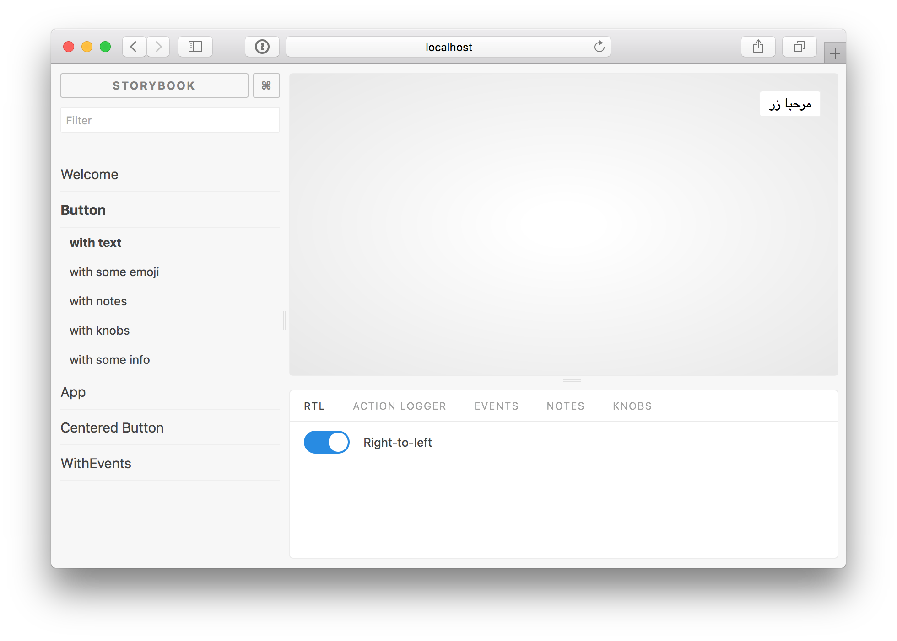

# Storybook Addon RTL [](https://www.npmjs.com/package/storybook-addon-rtl) [](https://travis-ci.org/unindented/storybook-addon-rtl)

Storybook Addon RTL allows you to switch to right-to-left flow in your stories in [Storybook](https://storybook.js.org).

This addon has been tested with Storybook for React, Vue and Angular. It should also work in other frameworks.




### Getting Started

```sh
npm i --save-dev storybook-addon-rtl
```

Add the addon to the addons array in `.storybook/main.js`

```js
module.exports = {
  /// other storybook configuration
  addons: [
    // other addons here
    "storybook-addon-rtl",
  ],
};
```

Add the following to `preview.js`:

```js
import { initializeRTL } from 'storybook-addon-rtl';

initializeRTL();
```

Then write your stories normally:

```js
import React from 'react';
import { storiesOf } from '@storybook/react';
import Component from './Component';

storiesOf('Component', module)
  .add('default', () => (
    <Component />
  ));
```

**Note:** You can force a story to show in right-to-left mode by adding the query parameter `direction=rtl`.


## Meta

* Code: `git clone https://github.com/unindented/storybook-addon-rtl.git`
* Home: <https://github.com/unindented/storybook-addon-rtl/>


## Contributors

* Daniel Perez Alvarez ([unindented@gmail.com](mailto:unindented@gmail.com))
* Benjamin Kindle ([benjaminkindle@yahoo.com](mailto:benjaminkindle@yahoo.com))


## License

Copyright (c) 2017 Daniel Perez Alvarez ([unindented.org](https://unindented.org/)). This is free software, and may be redistributed under the terms specified in the LICENSE file.
